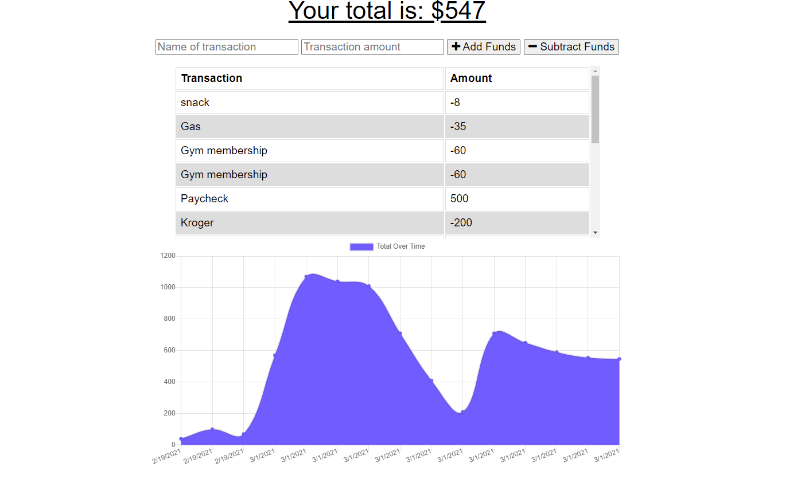

# Budget Tracker  
    
    
MIT
Copyright (c) [2020] [Austyn Whaley]

---

### Table of Contents

- [Description](#description)
- [Installation](#installation)
- [Usage](#usage)
- [Testing](#Testing)
- [Contribution](#Contribution)
- [Questions](#Questions)
    

---

## Description

### THis is a PWA application that will track funds weather the user is connected to the internet and will store data inside the browser DB

---

## Installation

### To install this program you will need to run

#### "npm install" to install all dependencies

---

## Usage

### Usage for this application:

#### It is used to track a budget and is aimed toward users with slow or lacking internet sources

---

## Testing

### How to test application:

#### Open dev tools in browser and find the 'Application' tab and find the 'Service Worker' section and test the application offline and then refresh when the application is back online

---

## Contribution

### The guidelines for contributon to this application are as follows:

#### there are no contributions

---

## Questions

Any questions regarding the application can be answered at:

[Link to Github](https://github.com/austynwhaley/)
##### Email: austyn_whaley@yahoo.com
    
